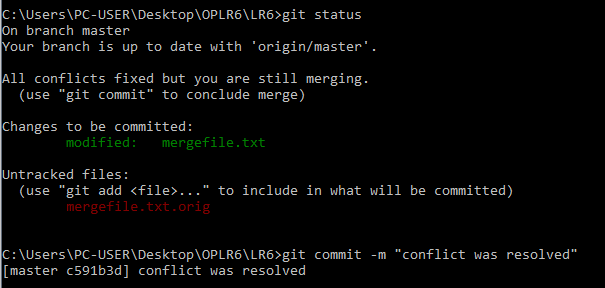
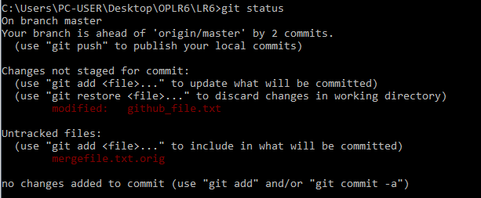
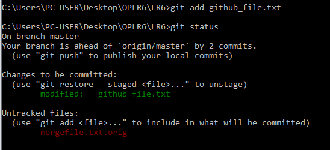
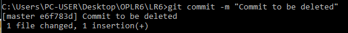
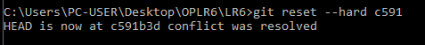
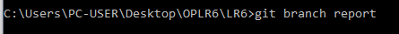

# LR6
Лабораторная работа №6

***

## Отчёт

### Шаги 1-6

После установки Git следует его настройка:

Далее клонируем удёлённый репозиторий:

Добавляем файл через интерфейс github:

Подтягиваем изменения в локальный репозиторий:

### Шаги 7-13

Получаем историю операций для каждой ветки:

master

branch1

Последние изменения:

#### Слияние ветки branch1 в master и разрешение конфликта с помощью mergetool.

Копируем branch1 из удалённого репозитория:

Возвращаемся на мастер:

Пытаемся сделать merge, но сталкиваемся с конфликтом:

Поэтому запускаем mergetool:

Закрываем mergetool и после успешного слияния удаляем локальную branch1

После этого делаем первый commit:

Далее сделаем дополнительный commit, чтобы его откатить. 
Для этого изменим github_file, который был добавлен через github:

Делаем commit:

Далее используем reset, чтобы его откатить:

И создаём ветку для отчёта:

### Логи команд

git config --global user.name "4917 Ivanov S.E" 
git config --global user.name 
git config --global user.email sergey_ivanov@mail.ru 
git config --global user.email

git clone https://github.com/serzhaa/LR6.git 
git pull

git log origin/master --oneline 
git log origin/branch1 --oneline 
git show --oneline

git checkout branch1 
git checkout master 
git merge branch1 
git mergetool 
git branch -D branch1 
git commit -m "conflict was resolved"

git status 
git add github_file 
git commit -m "Commit to be deleted" 
git reset --hard c591

git branch report