# LR6
Лабораторная работа №6

***

## Отчёт

### Шаги 1-6

После установки Git следует его настройка:

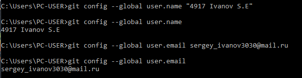

Далее клонируем удёлённый репозиторий:

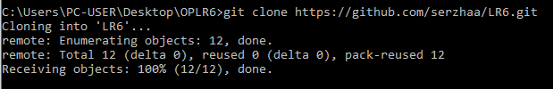

Добавляем файл через интерфейс github:

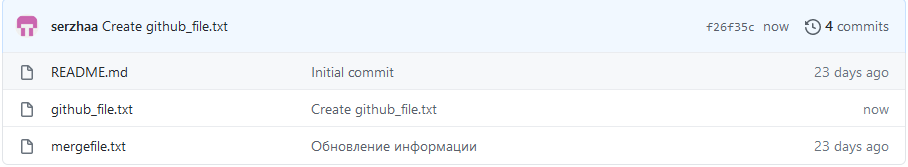

Подтягиваем изменения в локальный репозиторий:

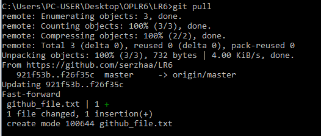

### Шаги 7-13

Получаем историю операций для каждой ветки:

master

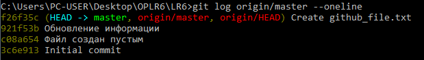

branch1

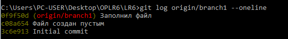

Последние изменения:

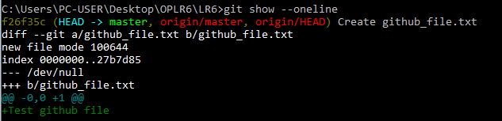

#### Слияние ветки branch1 в master и разрешение конфликта с помощью mergetool.

Копируем branch1 из удалённого репозитория:

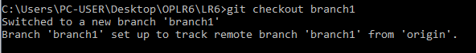

Возвращаемся на мастер:

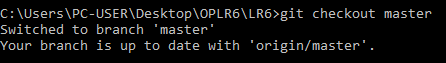

Пытаемся сделать merge, но сталкиваемся с конфликтом:

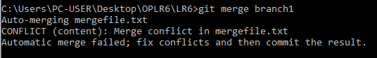

Поэтому запускаем mergetool:

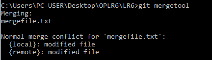

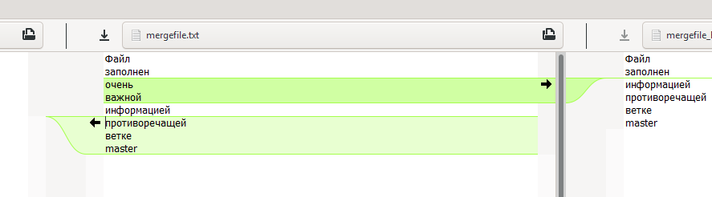

Закрываем mergetool и после успешного слияния удаляем локальную branch1

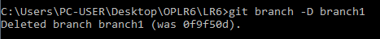

